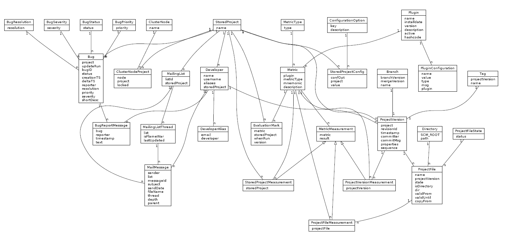
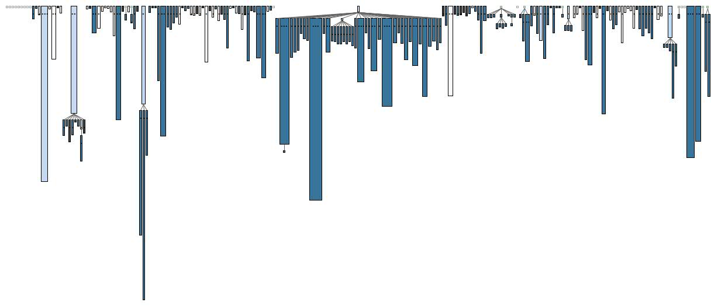
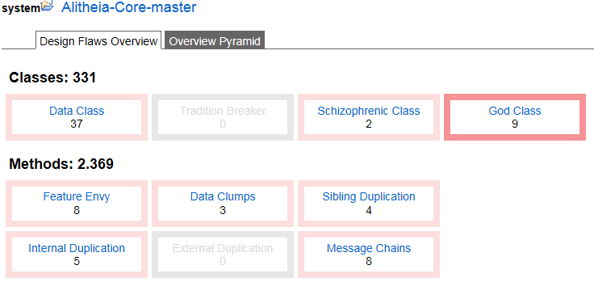
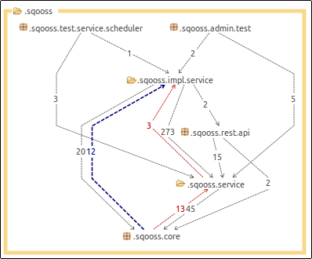
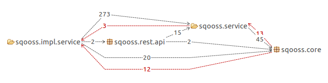
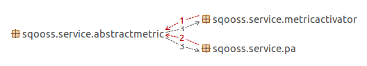

# IN4189 Software Reengineering - Reverse Engineering and Detection Report 
By Martijn den Hoedt - 4143760, Anton Bouter - 4167562

## Introduction
[Alitheia Core](http://www.sqo-oss.org/) is a platform for automatic evaluation of software that is designed to simplify software engineering research. It can produce a broad picture of the quality of an Open Source project by analysing both hard project artifacts (source code) and soft project artifacts (mailing list, bug tracker entries).
We performed a software analysis on the Alitheia Core to find shortcoming such as design flaws and code smells. The first chapter of this report will describe the system and its structure, while the second chapter is dedicated to pinpointing shortcomings of the Alitheia Core. The focus is on detecting violations of the S.O.L.I.D. object-oriented design principles. These include the following five principles:

 * Single responsibility principle
 * Open/closed principle
 * Liskov substitution principle
 * Interface segregation principle
 * Dependency inversion principle

To simplify the detection procedure, the following software evaluation tools have been used: 

 * [SonarQube](http://www.sonarqube.org/)
    - Open platform to manage code quality, which covers criteria such as complexity, potential bugs, duplications, architecture & design.
 * [inCode](https://www.intooitus.com/products/incode)
    - Detects design flaws automatically and helps you resolve them.
 * [X-Ray](http://xray.inf.usi.ch/xray.php)
    - Software visualization tool that provides e.g. a system complexity form and a class and package dependency view.
 * [UMLGraph](http://www.umlgraph.org/)
    - Allows automatic drawing of UML class and sequence diagrams.

## Initial Understanding and Detailed Model Capture

To find certain shortcomings in the design of the system, we must first understand it. This chapter is dedicated to the process of understanding the model and displaying its properties clearly by using reverse engineering tools to create models.

### Main features
What makes Alitheia Core stand out is that it not only evaluates the final product, but also the developing process. This is done by evaluating the so called soft project artifacts, such as mailing lists and bug tracker entries, which leads to a broader picture of the quality of the software project. The different aspects of that are analysed are aggregated through a [multilevel quality model](http://www.dmst.aueb.gr/dds/pubs/conf/2008-OSS-qmodel/html/SGSS08.htm) [[1]](http://www.sqo-oss.org/about).

The Alitheia Core can also be used to automate and parallellize the execution of custom experiments. Studies on empirical data can easily be performed and the Alitheia Core can also be extended to produce any measurement you are interested in.

### Important source code entities

The main class of the Alitheia Core is `AlitheiaCore`, in the `eu.sqooss.core` package, which initializes the core components of the system and provides a static instance of AlitheiaCore. All services of the `AlitheiaCore` class can then be called by using the methods defined in the `AlitheiaCoreService` interface, which is present in the same package as the `AlitheiaCore` class. These services are implemented in the `eu.sqooss.service` package and divided into a large number of packages, such as `admin`, `db`, `scheduler`, `updater` and `util`. Each package can also contain classes that the service depends on.

### Impression of design and implementation

We think that the Alitheia Core system looks well structured, because the classes seem to be properly distributed among packages with names that provide useful information. The core is properly isolated from the classes that provide services. Many classes also contain javadoc comments and additional comments to clarify functions when needed. However, the number of tests is very limited. We therefore have a relatively good first impression of the design and implementation of the system. Although the test suite should be expanded, we think reengineering the Alitheia Core is feasible, because the javadoc documentation makes it much easier.

### Exceptional entities

To study the exceptional entities, such as packages, classes and methods, a UML diagram can be very useful. Such a diagram shows which classes are related and in what way. A UML diagram can also be reverse engineered by a tool such as [UMLGraph](http://www.umlgraph.org/). The diagram in figure 1 displays all database objects and was created by Georgios Gousios using the UMLGraph tool on the Alitheia Core system [[2]](http://www.umlgraph.org/doc/ceg-er.html). From this diagram we can clearly see that many classes depend on the StoredProject class. The same goes for the Metric, ProjectVersion and Bug classes. All of these classes are part of the eu.sqooss.service.db package, which definitely is an exceptional entity, because it contains a very large number of classes. 

*Figure 1: UML Diagram of the concrete database entities of Alitheia Core*

### Inheritance structure

As described earlier, the system is composed of many service interfaces that extend the `AlitheiaCoreService` interface, such as `DBService`, `AdminService`, `LogManager` and `RestService`. The implementations of all these classes must also implement the basic functions of the `AlitheiaCoreService` class.

The inheritance structure is also displayed in Figure 2, which was created using X-Ray. A dark blue block is a concrete class, a light blue block is an abstract class and a white block is an interface. The length of each block denotes its number of lines of code, while the width denotes the number of methods. We can clearly see the structure of the database in the middle, with a large number of concrete classes that extend the abstract class DAObject.

*Figure 2: X-Ray Diagram that displays the inheritance structure.*

### Step through execution

## Problem Detection
After familiarizing ourselves with the system through the first chapter, we can now thoroughly look at the system to identify design flaws and/or code smells. We will first focus on the S.O.L.I.D. design principles, which were already named in the introduction. The meaning of each of these principles will first be explained, after which an example is shown from the Alitheia Core system. After the five basic S.O.L.I.D. principles, we will also try to find pieces of code that violate the Acyclic Dependencies Principle and lines of duplicated code. 

### Single Responsibility Principle (SRP)
This principle states that every software entity (class, function, variable, etc.) should have a single purpose and only one reason to change.  If it is violated, the violating entity should be split into two or more entities that satisfy the Single Responsibility Principle.

A very large class is the most likely to break this principle, so we used the tool [inCode](https://www.intooitus.com/products/incode) to give a nice overview of properties such as number of methods and lines of code for each class. A screenshot of the overview of inCode is shown in Figure 3. This tool found nine so-called God classes, where two of them are scoring a 10 out of 10 (`GitUpdater` and `ContributionMetricImpl`). The `GitUpdater` has 767 lines of code, but another bigger class called `SVNUUpdaterImpl` has 993 lines of code.

*Figure 3: An overview of the design flaws that inCode has found.*

Both the `ContributionMetricImpl` and the `GitUpdater` classes have many methods, use many attributes from many external classes. The `ContributionMetricImpl` class has methods such as `cleanupResource`, `run` and `updateField`. This implies that this class has multiple responsibilities, because cleaning up, running and updating a field should be considered separate tasks/responsibilities. The violation of the Single Responsibility Principle can possibly be fixed by splitting this class into multiple classes, each with their own unique responsibility. In this case, we should consider creating three separate classes that are responsible for cleaning up the resource, running the contribution metric and for updating the database. Because `ContributionMetricImpl` is such a large class, it might very well need to be split up in more than three classes to completely adhere to the Single Responsibility Principle.
 
The first couple of methods of the `GitUpdater` class are `setUpdateParams`, `update` and `updateFromTo`. Up to this point, this class adheres to the Single Responsibility Principle, because its only responsibility is updating. However, later on we encounter the methods `processOneRevision`, `getAuthor` and `processCopiedFiles`, which seemingly involve other responsibilities than just updating. Again, this violation should be resolved by splitting the `GitUpdater` class into multiple classes that all have a single responsibility. This class also contains multiple to-do's and code that is commented out, which should also be fixed when the code is being reengineered. 

Finally, the definition of `DecreasingLongComparator` and `RandomizedCompatator` within the `MetricActivatorImpl` class also violates the Single Responsibility Principle, because the implementation of comparators should not be a responsibility of this class. 

Violations of the Single Responsibility Principle can cause code to be hard to locate, because it might be placed in a class that is mainly used for something completely different. This in turn causes the code to be more difficult to understand and to maintain.

### Open/Closed Principle (OCP) or Liskov Substitution Principle (LSP)

According to the Open/Closed principle, software entities should be open for extension, but closed for modification. This means that the software must be extensible without modifications to its source code. Also, an extension may not lead to a change in behaviour of the code that is extended.

The principles of object oriented programming are underlined by the Liskov Substitution principle. It states that subtypes must be substitutable for their base types. Therefore, if a method expects some object A as a parameter, this method should also accept any class that is a subclass of A. The post-conditions of the method should still hold after such a substitution.

### Interface Segregation Principle (ISP)
According to this principle, no client should be forced to depend on methods it does not use. When the superclass of some class A contains methods that are not applicable to A, the Interface Segregation Principle is violated. When this happens, the superclass should be split such that its children do not have access to methods that are not applicable.

At this time, we have not searched for violations of this principle, but we might do this in the future if necessary.

### Dependency Inversion Principle (DIP)

This principle states that high-level modules should not depend on low-level modules. Additionally, abstractions should not depend on details, but details should depend on abstractions. This means that the high-level modules cannot simply use low-level modules to perform some task. An interface should be used that implements the functions of the low-level module. The high-level class then calls the methods of the interface and the low-level class implements the interface.

The STAN Eclipse plugin marks the following depedencies between the `AlitheiaCore` class and `AdminServiceImpl`, `ClusterNodeServiceImpl`, `DBServiceImpl`, `FDSServiceImpl`, `MetricActivatorImpl`, `PAServiceImpl`, `ResteasyServiceImpl`, `SchedulerServiceImpl`, `TDSServiceImpl`, `UpdaterServiceImpl` and `WebadminServiceImpl` classes. These classes that end with "Impl" have an interface class, but the `AlitheiaCore` class depends on the concrete class instead. There is also a dependency between the `RestServiceApp` and `RestServiceRegistery` classes, and between the `DiffFactory` and `UnifiedDiffParser` classes. The `DiffFactory` class instantiates a `UnifiedDiffParser` object and is not using the interface class. The `AlitheiaCore` class is also instantiating a `LogManagerImpl` object instead of using its interface.

These examples above are violations of the Dependency Inversion Principle, because the the high-level class (e.g. `AlitheiaCore`) directly depends on the low-level class (e.g. `AdminServiceImpl`). This can easily be fixed, because interfaces already exist for all classes. Simply changing each reference to an abstract class to a reference to the interface should work, but it should still be tested before we can implement these changes.

*Package dependencies*

### Acyclic Dependencies Principle (ADP)

This very simple principle states that software entities should not have cyclic dependencies. This is the case when some entity `A` depends on some entity `B`, but `B` also (indirectly) depends on `A`. Dependency cycles of more than two classes also violate the principle and should therefore be avoided.

There are two cases of a violation of the Acyclic Dependencies Principle detected by X-Ray. There is a cycle between the `Status` and `BugStatus` class. There is also a cycle between the `Severity`and the `BugSeverity` class. Both `Status` and `Severity` are `enum`s within `BugStatus` and `Severity` respectively. Therefore we don't see it as a actual ADP violation.

STAN4J gave a better overview of all classes, packages and dependencies between those in the project. Within the `.service.db` package a lot of cyclic dependencies can be found. One of these is the cyclic dependency between the `Plugin` and the `Metric` class. There are also cyclic dependencies between packages (*see figure below*).

### Don't Repeat Yourself (DRY)

Another very simple principle is the DRY principle, which states that duplicate code must be avoided. This principle is violated when the modification of one element requires the modification of another unrelated element.

We have looked for duplicated code with [SonarQube](http://www.sonarqube.org/). This tool found 313 lines of code (LOC) in a total of 31,760 LOC. Thus only 1% of the Alitheia Core project is duplicate code. The project contains 15,688 LOC with Java, the rest is comments or whitespace. We investigated a few instances of code duplication. One of them is `BugResolution` (lines 121-135) and `BTSEntry` (lines 203-216). 

### Simple shortcomings
SonarQube is also able to detect a lot of other issues. In Alitheia Core are 1770 issues. These issues can point out confusing code formatting, like inconsistently placing curly braces. Also more important issues like never throwing generic exceptions, such as `Exception`, are detected in the Alitheia Core project.

SonarQube is also able to calculate the complexicity of the code. The [complexity metrics](http://docs.codehaus.org/display/SONAR/Metrics+-+Complexity) used by SonarQube count every  `if`, `for`, `while`, `case`, `catch`, `throw` and `return` statement. The `PluginsView` has the highest complexity per function, but also a high amount of code per method. The inCode tool also found classes and methods with a high complexity.
