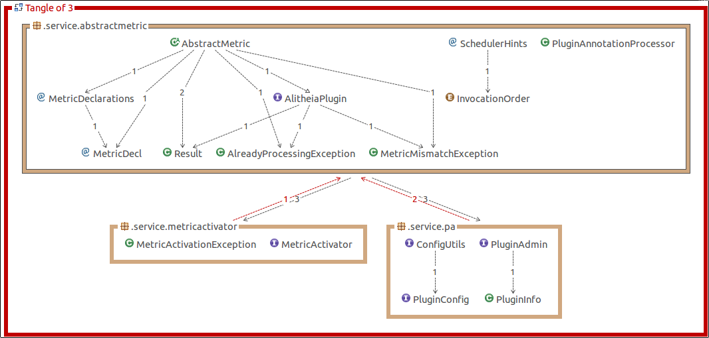
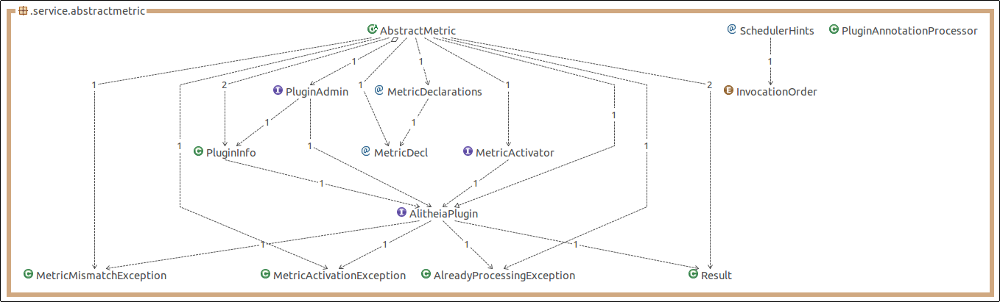

# IN4189 Software Reengineering - Testing and Refactoring Report
By Martijn den Hoedt - 4143760 and Anton Bouter - 4167562

## Tests

## Refactoring

### Package Dependency Cycle
Between the `.service.abstractmetric` and the `.service.metricactivator` packages was a cyclic dependency. Also between the `.service.abstractmetric` and the `.service.pa` package was a cyclic dependency. These cycles can also be seen in the image below. 

To fix these cycles we have merged the `.service.abstractmetric` and the `.service.metricactivator` packages and moved `PluginAdmin` interface and `PluginInfo` class to the `.service.abstractmetric` package. The result can be seen in the image below.

These changes are a good idea, because now the amount of cyclic dependencies is reduced. With is fix we didn't introduce new cyclic dependencies and there are no cyclic dependencies in the `.service.abstractmetric` package. The package did become larger, but the four files added have a lot to do with the most important class `AbstractMetric`.

## Bug Fixes

### SchedulerStats
In `eu.sqooss.service.scheduler.SchedulerStats.java` we found a few bugs in the `removeWaitingJob(String classname)` method.

    public synchronized void removeWaitingJob(String classname) {
	    this.waitingJobs --;
	    if (waitingJobTypes.containsKey(classname)) {
		    int jobs = waitingJobTypes.get(classname) - 1;
		    if (jobs == 0) {
			    waitingJobTypes.remove(classname);
		    }

		    waitingJobTypes.put(classname, jobs);
	    }
    }

This code doesn't make much sense, because now the amount of waiting jobs (`waitingJobs`) can become negative. Also the check "`if (jobs == 0)`" is completely useless, because what will be removed from the map will be put back right away. Therefore we changed it to the following, which will change the behavior of the code, but makes much more sense. 

	public synchronized void removeWaitingJob(String classname) {
		if (waitingJobTypes.containsKey(classname)) {
			this.waitingJobs--;
			int jobs = waitingJobTypes.get(classname) - 1;
			if (jobs <= 0) {
				waitingJobTypes.remove(classname);
			} else {
				waitingJobTypes.put(classname, jobs);
			}
		}
	}

## Recommendations 
