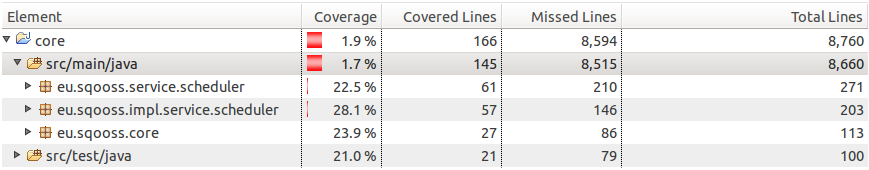
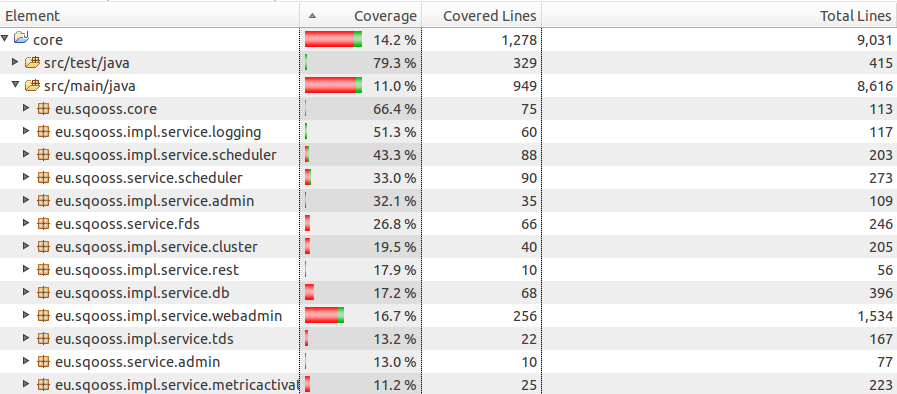

# IN4189 Software Reengineering - Testing and Refactoring Report
By Martijn den Hoedt - 4143760 and Anton Bouter - 4167562

## Introduction

In order to improve the maintainability of the Alitheia Core system, we have performed a number of refactorings. These refactorings include the removal of cyclic dependencies and violations of the Single Responsibility Principle, as well as some minor fixes. To ensure that the refactorings did not break the system, we have created unit tests for the involved classes. Reports of the test coverage is added to illustrate the newly added tests.

## Tests

The first major issue with the system is its lack of test cases. Before the refactorings, the line coverage of the core package was only 1.7%, which is shown in the figure below. Subpackages with 0% coverage were omitted.

To facilitate refactoring, unit tests must be present. Therefore we have created tests for the classes which we have refactored. This slightly increased the coverage, but the total coverage is still incredibly low. The classes for which we have made unit tests are listed below. These tests can be found in packages with corresponding names in the `src/test/java` folder:

 - `SchedulerStats` in package `eu.sqooss.service.scheduler`
 - `InMemoryDirectory` in package `eu.sqooss.service.fds`
 - `InMemoryCheckoutImpl` in package `eu.sqooss.impl.service.fds`
 - `ProjectsView` in package `eu.sqooss.impl.service.webadmin`
 - `WebAdminRenderer` in package `eu.sqooss.impl.service.webadmin`
 
The line coverage of the core package after adding new tests is displayed in the figure below. It was increased considerably to a line coverage of 11% for the core package. This time, subpackages with a coverage less than 10% were omitted.

## Refactoring

### Single Responsibility Principle

As pointed out in the previous report, the `GitUpdater` class in the `eu.sqooss.plugins.updater.git` package was a very large file of 841 lines of code that had many different and unrelated methods. This class violates the Single Responsibility, because this method does not have a single responsibility, because it is responsible for many more things, since its methods are unrelated. This violation causes the code to be more difficult to understand, and therefore to maintain. Splitting the `GitUpdater` class in more classes, such that each class only has related methods, and therefore a single responsibility, will resolve the violation.

We have split this class into four separate classes: `GitUpdater`, `GitProcessor`, `GitFileManager` and `GitMessageHandler`. The `GitUpdater` class contains the high-level methods responsible for updating the database, while `GitProcessor` is responsible for processing revisions to find e.g. branching info. Finally, the `GitFileManager` contains all methods that involve moving/copying files or directories and the `GitMessageHandler` prints info, warnings and debug output to the log. The dependencies between these classes are shown in the figure below, where the number on each dependency denotes the number of references.

Even though a few tests were present for the `GitUpdater` class, they would not even run on a fresh copy of the Alitheia Core system. After a number of modifications, we ended up with the error that the system was unable to find the JDBC driver org.h2.Driver, which we were unable to resolve. This means we were not able to actually execute any tests for `GitUpdater` and any of the new classes. Having example tests that also require an active database session would certainly have helped us. This emphasizes the importance of test cases when refactoring a system. However, we have created a number of tests for the four new classes, but these will not function without a working database session.

### Package Dependency Cycle
When packages depend on eachother in a cycle they violate the Acyclic Dependency Principle (ADP). Such a cyclic dependency existed between the `.service.abstractmetric` and the `.service.metricactivator` packages. Another existed between the `.service.abstractmetric` and the `.service.pa` packages. These cycles can also be seen in the image below. 

To fix these cycles we have merged the `.service.abstractmetric` and the `.service.metricactivator` packages and moved `PluginAdmin` interface and `PluginInfo` class to the `.service.abstractmetric` package. The result can be seen in the image below.

These changes are a good idea, because now the amount of cyclic dependencies is reduced. With is fix we didn't introduce new cyclic dependencies and there are no cyclic dependencies in the `.service.abstractmetric` package. The package did become larger, but the four added files have a lot to do with the most important class `AbstractMetric`.

### Class Dependency Cycle in `.service.fds`
Cyclic dependencies can also exist between classes, which also violates the ADP. The dependency between the `InMemoryDireectory` class and the `InMemoryCheckout` interface was a cyclic one. All the dependencies in the `.service.fds` package are visible in the image below. 

In order to break the cycle we have removed the dependency from `InMemoryDirectory` to `InMemoryCheckout`.  To make this possible we have removed some functionality from `InMemoryDirectory`, which is now available in the `InMemoryCheckoutImpl` class which implements the `InMemoryCheckout` interface. The resulting package structure, after the changes to its structure, is displayed in the image below.

### Class Dependency Cycles in `.service.db`

In the `.service.db` a very large tangle of classes can be found, as many as 38 classes depend on each other. To untangle these classes we have removed some dependencies between classes.

Between `Tag` and `StoredProject` was a cyclic dependency, this was due a two static methods in `Tag` that were called from `StoredProject` and needed a `StoredProject` as parameter. These two methods have been moved to `StoredProject` and are now non-static. This also follows the Object Oriented Programming way of programming better.

In order to remove yet another cyclic dependency, we moved two static methods from the `PluginConfigurator` to the `Plugin` class. This solves a part of the dependency between the two. `PluginConfigurator` still has a getter and setter for a `Plugin` object. This getter is never called, the setter is only called once and `PluginConfigurator` never uses the `Plugin` object in one of its methods. Therefore we removed the getter and setter and the variable declaration. Now the `PluginConfigurator` class doesn't depend on `Plugin`, thus the cyclic dependency is solved.

### Don't Repeat Yourself (DRY)

With Google CodePro AnalytiX we found several instances of violations of the DRY princliple. On should not copy past code, because you will introduce the same bug on multiple places and it's hard to maintain. In `FDSSerivceImpl` the methods `getInMemoryCheckout(ProjectVersion pv, Pattern pattern)` and `getCheckout(ProjectVersion pv, String path)` have more than 10 lines of code exactly the same. We extracted a part of the method to a new method called `getSCNAccesor(ProjectVersion pv)`. Also in `WebAdminRenderer` we reduced the amount of duplicate code. The methods `renderJobFailStats()` and `renderJobWaitStats()` had about 20 lines of code in common. This time we made to methods which are now both called instead of those 20 lines of code. The method `createFrom(.., ..)`, wich was around 250 LOC, has been reduced 40 LOC in size. This is done by exacting duplicate code in a new method called `addButtonSet(....)` which adds two buttons to the HTML code. This new method is called twice from the `createFrom(.., ..)` method. 

## Bug Fixes

### SchedulerStats
In `eu.sqooss.service.scheduler.SchedulerStats.java` we found a few bugs in the `removeWaitingJob(String classname)` method. The old code, which included these bugs, is visible below. 

    public synchronized void removeWaitingJob(String classname) {
	    this.waitingJobs --;
	    if (waitingJobTypes.containsKey(classname)) {
		    int jobs = waitingJobTypes.get(classname) - 1;
		    if (jobs == 0) {
			    waitingJobTypes.remove(classname);
		    }

		    waitingJobTypes.put(classname, jobs);
	    }
    }

This code does not make much sense, because now the amount of waiting jobs (`waitingJobs`) can become negative. Also the check "`if (jobs == 0)`" is completely useless, because what will be removed from the map will be put back right away. Therefore we changed it to the following, which will change the behavior of the code, but makes much more sense. 

	public synchronized void removeWaitingJob(String classname) {
		if (waitingJobTypes.containsKey(classname)) {
			this.waitingJobs--;
			int jobs = waitingJobTypes.get(classname) - 1;
			if (jobs <= 0) {
				waitingJobTypes.remove(classname);
			} else {
				waitingJobTypes.put(classname, jobs);
			}
		}
	}

## Recommendations 

To further improve the maintainability of the system, we recommend some further refactorings. However, to perform refactorings, unit and integration tests are very much required to not break the system. With a coverage of only 1.7% of the core, these were severely lacking. Even after the refactorings, a coverage of 9.8% is still very low.

Therefore our first recommendation is to build a complete test suite for the system. This will be quite a large investment, but it will definitely pay off in the long run, because it will make refactorings much less time consuming. Units tests would have prevented bugs as the ones described in the "Bug Fixes" section. Additionally, tests will make it easier to extend the system, especially after many of the developers that originally designed the system will have departed.

The system consists of many very large methods, this make testing very hard. Especially classes with HTML code generation consist of much code duplication. We have already fixed a few instances of code duplication, but there are many more. When methods are split up in smaller ones, it will also become easier to remove duplicated code. Therefore we recommend to split up methods where possible. The `PluginsView` class, with a method of almost 900 lines of code and multiple instances of DRY violations, is a good one to start with.

## Conclusions

Even though the maintainability of the Alitheia Core system has been improved, it is still far from optimal, mainly because of the lack of tests. Therefore we recommend to invest in creating a test suite that covers a very large part of the project, because this will pay off in the long run.
