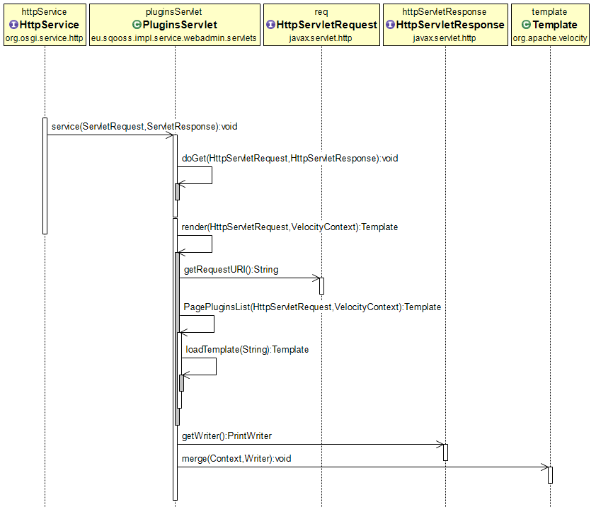
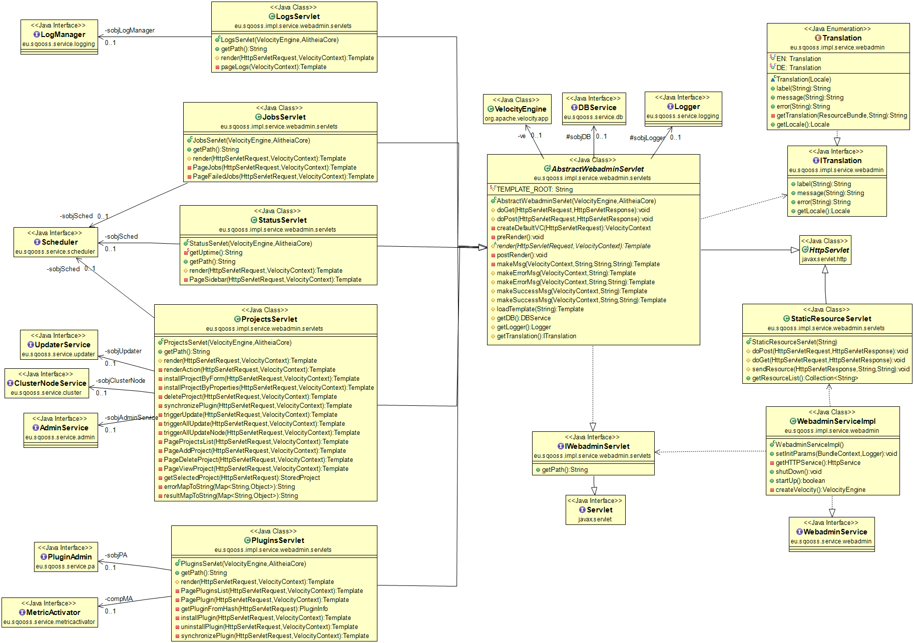

# Webadmin structure explained #

The general flow of the webadmin package is as follows:

1. HTTP Service hands request to servlet
2. Code in the `AbstractWebAdminServlet` initializes general things and calls the concrete servlets `render` method
3. `render` method switched on the requist URI and hands the request to a (private) method
4. Method executes logic, loads a **template** and populates the template context (variables)
5. Template is merged by the Velocity templating system to the HTTP response

This is demonstated in an simplified sequence diagram for a GET request to `/plugins`:

you should not deviate from this model to keep things consistent.

You can take a look at the class diagram to get a more complete picture and see what kinds of servlets there are:

All diagrams were made with [ObjectAid](http://www.objectaid.com/).